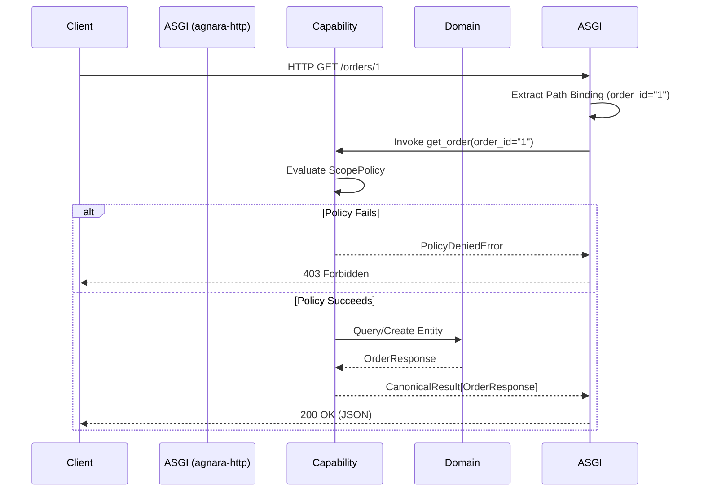

# System Architecture

## Architectural Purpose

This repository validates the integration of the **Agnara Capability** framework with the **Agnara HTTP Adapter** in version `0.1.0a8`. It demonstrates an architectural pattern where HTTP routes are merely transport-layer bindings, and business logic is exclusively governed by capabilities, policies, and domain models.

## Architectural Boundaries

The system is strictly divided into three layers:

1. **Domain Layer (`src/app/domain.py`)**: 
   - Defines the structural contracts (`dataclasses`) for the application.
   - Contains no framework dependencies, no HTTP context, and no validation libraries beyond standard Python dataclass mechanics.

2. **Capability Layer (`src/app/capabilities.py`)**:
   - The semantic center of the application.
   - Declares operations as `agnara.App.capability`.
   - Owns authorization logic via `@app.capability(scopes=[...])`.
   - Returns canonical `agnara.execution.Failure` values upon logical errors, which are entirely detached from HTTP status codes.

3. **Transport Layer (`src/app/server.py`)**:
   - Converts the capability registry into an ASGI 3 application via `agnara_http.Http`.
   - Exclusively responsible for declaring `Binding` (mapping paths, queries, and bodies to capability arguments) and `OpenApiOperation` metadata.
   - Performs no business validation.

## Flow of Execution

## Security Boundaries

- Security policies (like `ScopePolicy`) are inherently tied to the capabilities. 
- The HTTP layer trusts the Capability layer to enforce rules.
- Authentication/Principal injection is handled by the underlying execution context during capability invocation.

## Intentionally Excluded

- **Databases:** We use an in-memory dictionary for state to isolate the validation to the Agnara HTTP adapter.
- **Frameworks:** No FastAPI or Flask. The application is purely ASGI compiled via Agnara.
- **Swagger UI:** The `0.1.0a8` release provides raw OpenAPI generation (`/openapi.json`), but UI serving is excluded as it is not part of the public supported API surface in this version.
